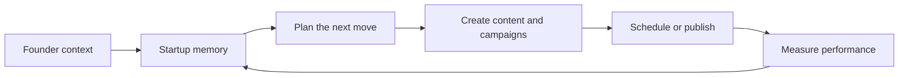
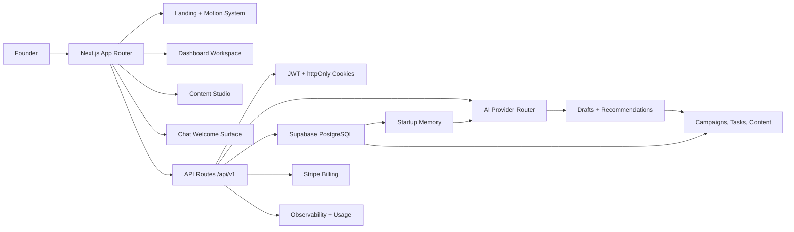
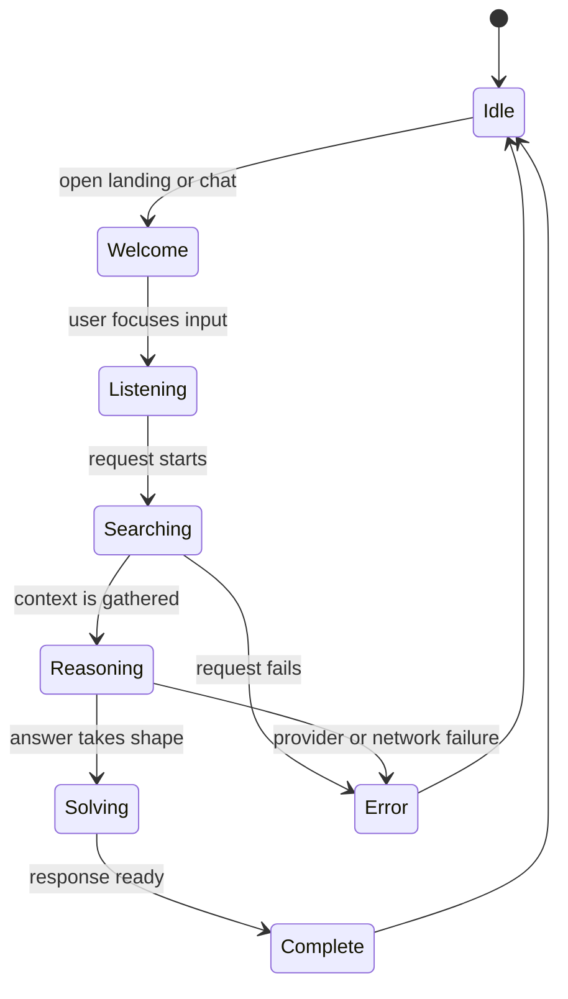
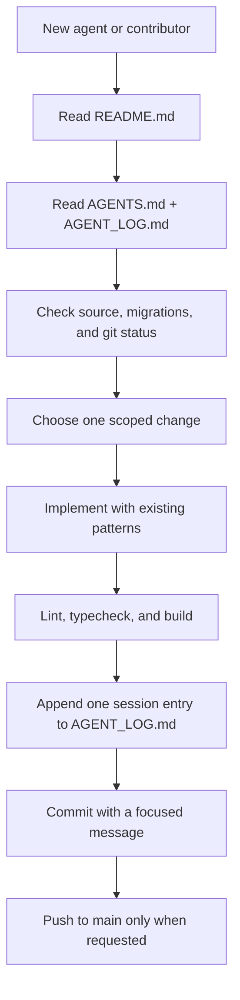

# DeepMark

> **Marketing execution intelligence for founders.**
>
> DeepMark gives a startup a working memory for its business, then turns that memory into clearer plans, differentiated content, and measurable execution.

[](https://github.com/benardprince-m/Deepmark-/actions/workflows/ci.yml)

DeepMark is an early-stage product in active development. The repository is both a working Next.js application and a product laboratory: some flows are already wired end to end, while other surfaces are deliberately being validated in the frontend before their external integrations are finalized.

This README is the **canonical orientation document** for founders, contributors, and future agents. It explains what DeepMark is, what exists today, how the system is shaped, and how to make a safe change without mistaking a mock or partial flow for production behavior.

---

## 1. Product context

Most startup marketing systems lose context between the founder's strategy, the content they create, and the results they measure. DeepMark is intended to close that loop.

A workspace stores durable startup context—identity, business, audience, marketing constraints, and working memory. That context feeds planning and AI-assisted content creation. Campaigns produce tasks and content. Analytics feed useful signals back into the workspace so future decisions get sharper instead of starting from a blank prompt.



The product should feel less like a generic AI text box and more like a calm, memory-aware marketing partner. The current visual direction follows that principle: an original DeepMark mascot represents presence and identity, while a restrained orb layer represents active reasoning.

## 2. Current status at a glance

| Area | Current state | Source of truth |
| --- | --- | --- |
| Landing experience | Implemented with a seven-second mascot/orb intro, skip control, and reduced-motion behavior | `src/app/page.tsx`, `src/components/motion/` |
| Dashboard | Implemented as the authenticated workspace shell with dashboard, Studio, Planner, Plan, Analytics, Settings, and Chat navigation | `src/app/dashboard/` |
| Content Studio | Implemented UI with content-type selection and AI generation request path | `src/app/dashboard/studio/page.tsx`, `src/app/api/v1/studio/` |
| Thinking animation | Pong loader replaced by mascot-to-orb reasoning states | `src/components/thinking/ThinkingAnimation.tsx` |
| Chat surface | First welcome surface implemented; message submission and deeper chat orchestration remain unfinished | `src/app/dashboard/chat/page.tsx` |
| Authentication | JWT-based API/session flow exists; verify behavior against `src/lib/auth.ts`, cookies, and auth routes before changing it | `src/app/api/v1/auth/`, `src/lib/` |
| Database | Supabase schema and migrations exist through migration 009, including RLS hardening and account/billing additions | `supabase/migrations/` |
| AI | Provider routing, capability registry, quota, retry, memory, and OpenRouter adapter code exist; live provider configuration is environment-dependent | `src/lib/ai/` |
| Billing | Stripe routes and subscription helpers exist; never treat them as configured without real environment values and webhook setup | `src/lib/stripe.ts`, `src/app/api/v1/billing/` |
| Deployment | GitHub Actions runs lint, typecheck, build, and Railway deployment on `main` when required secrets are present | `.github/workflows/ci.yml` |

### What is intentionally not claimed

The presence of a route, component, migration, or button does not by itself prove that a feature is production-ready. When assessing a feature, inspect the route implementation, its auth and database behavior, and its error path. The project has historically contained stale UI and partial integrations; this README favors observed behavior over aspirational language.

---

## 3. System architecture



A rendered copy of the architecture is available at [`docs/diagrams/rendered/architecture.png`](docs/diagrams/rendered/architecture.png), with the editable Mermaid source at [`docs/diagrams/architecture.mmd`](docs/diagrams/architecture.mmd).


### Runtime layers

1. **App Router UI** — route-level pages in `src/app/`, including the public landing experience, auth screens, dashboard workspace, Studio, and Chat.
2. **Motion system** — original SVG mascot and lightweight SVG particle layer in `src/components/motion/`; request-state animation in `src/components/thinking/`.
3. **API boundary** — versioned handlers in `src/app/api/v1/`. API responses should use the helpers in `src/lib/api-response.ts` and enforce the route's auth and workspace scope.
4. **Domain libraries** — auth, JWT, rate limiting, AI routing, memory quality, usage, observability, Stripe, Supabase, and shared utilities live in `src/lib/`.
5. **Persistence and integrations** — Supabase is the application database; Stripe handles billing; AI providers are selected through the provider router and capability registry.

### Request path

```text
Browser
  -> Next.js page or client component
  -> /api/v1 route handler
  -> auth / rate-limit / validation
  -> domain library or provider adapter
  -> Supabase, Stripe, or AI provider
  -> normalized API response
  -> UI state and motion state
```

Keep this boundary clear. Do not call Supabase service-role operations from a client component, do not move secrets into `NEXT_PUBLIC_*` variables, and do not add a second auth mechanism without documenting the migration path.

---

## 4. Repository map

```text
Deepmark-/
├── src/
│   ├── app/
│   │   ├── page.tsx                    # Public landing page + intro animation
│   │   ├── auth/                       # Login and signup screens
│   │   ├── dashboard/                  # Authenticated product surfaces
│   │   │   ├── page.tsx                # Workspace shell and navigation
│   │   │   ├── studio/page.tsx         # AI content Studio
│   │   │   └── chat/page.tsx           # First chat welcome surface
│   │   └── api/v1/                     # Versioned API route handlers
│   ├── components/
│   │   ├── ai/                         # AI panels and related types
│   │   ├── memory/                     # Startup-memory editing sections
│   │   ├── motion/                     # DeepMark mascot and landing intro
│   │   ├── thinking/                   # Request-state reasoning animation
│   │   └── ui/                         # Shared UI primitives
│   ├── lib/
│   │   ├── ai/                         # Registry, routing, adapters, quota, memory
│   │   ├── auth.ts, jwt.ts, cookies.ts # Session and token helpers
│   │   ├── supabase.ts                  # Supabase clients
│   │   ├── stripe.ts                    # Stripe client and billing helpers
│   │   └── observability/               # Audit, usage, Sentry integration
│   ├── middleware.ts                    # Request middleware
│   └── types/                           # API and database TypeScript types
├── supabase/migrations/                 # Ordered database migrations 001–009
├── docs/diagrams/                       # Editable Mermaid diagrams and rendered PNGs
├── .github/workflows/ci.yml             # CI and Railway deployment workflow
├── AGENTS.md                            # Next.js-specific rules for coding agents
├── AGENT_LOG.md                         # Required per-session agent history
├── .env.example                         # Environment variable contract
└── package.json                          # Scripts and dependencies
```

The repository has a nested app directory in `Deepmark-/` when viewed from the review workspace. On GitHub, the application root is the repository root.

---

## 5. Local development

### Prerequisites

- Node.js 20 or newer
- npm
- A Supabase project for database-backed routes
- Stripe test credentials if exercising billing routes
- An AI provider configuration if exercising live generation

### Install and configure

```bash
git clone https://github.com/benardprince-m/Deepmark-.git
cd Deepmark-
npm ci
cp .env.example .env.local
```

Fill in `.env.local`. The complete variable contract is maintained in `.env.example`:

```dotenv
NEXT_PUBLIC_SUPABASE_URL=https://your-project.supabase.co
NEXT_PUBLIC_SUPABASE_ANON_KEY=your-anon-key
SUPABASE_SERVICE_ROLE_KEY=your-service-role-key
JWT_SECRET=use-a-long-random-secret

STRIPE_SECRET_KEY=sk_test_...
STRIPE_WEBHOOK_SECRET=whsec_...
STRIPE_STARTER_PRICE_ID=price_...
STRIPE_PRO_PRICE_ID=price_...
STRIPE_ENTERPRISE_PRICE_ID=price_...

NEXT_PUBLIC_APP_NAME=DeepMark
NEXT_PUBLIC_APP_URL=http://localhost:3000
NODE_ENV=development
```

`JWT_SECRET` is required during server module initialization. Some billing and provider routes also initialize external clients during build or route collection, so use valid test-mode configuration when running a full production build.

### Database

Apply the migrations in order using the Supabase CLI or the Supabase dashboard. The current sequence is:

```text
001_initial_schema.sql
002_add_notifications.sql
003_production_observability.sql
004_subscription_system.sql
005_retention_engines.sql
006_fix_rls_bypass.sql
007_email_verification.sql
008_password_reset.sql
009_stripe_customers.sql
```

Do not create an ad-hoc migration route in the application. Database schema changes belong in `supabase/migrations/`, should be reviewed for tenant isolation, and should be applied through the normal Supabase workflow.

### Run the app

```bash
npm run dev
```

Open [http://localhost:3000](http://localhost:3000).

Useful routes for a visual check:

- `/` — landing intro and mascot hero
- `/auth/login` — login surface
- `/dashboard` — authenticated workspace shell
- `/dashboard/studio` — content Studio and reasoning animation
- `/dashboard/chat` — mascot welcome surface

---

## 6. Validation commands

The repository currently exposes these package scripts:

```bash
npm run lint
npm run build
npx tsc --noEmit
```

For a focused frontend change, run the relevant lint targets first, then the full checks:

```bash
npx eslint src/components/motion src/components/thinking src/app/page.tsx
npx tsc --noEmit
npm run build
```

The GitHub workflow runs lint, typecheck, build, and—on `main`—Railway deployment. The build requires the CI secrets configured in `.github/workflows/ci.yml`; do not commit local secrets or replace production secrets with placeholders.

---

## 7. API surface

The API is versioned under `/api/v1`. These are the major route groups currently present:

| Group | Purpose |
| --- | --- |
| `/auth/*` | Signup, login, logout, session lookup, refresh, email verification, password reset |
| `/workspaces/*` | Workspace lifecycle and scope |
| `/startups/*` | Startup records and context |
| `/memory/*` | Workspace memory records |
| `/campaigns/*` | Campaigns and related execution objects |
| `/content/*` | Content records and analytics relationships |
| `/tasks/*` | Execution tasks |
| `/trends/*` | Global and velocity trend data |
| `/analytics/*` | Startup analytics and sync operations |
| `/studio/*` | AI-assisted generation and enhancement |
| `/integrations/*` | External integration records |
| `/notifications` | Notification data |
| `/subscription/*` and `/billing/*` | Usage, subscriptions, checkout, portal, and webhooks |
| `/health` | Health check without normal auth requirements |

For exact method behavior, inspect the route file. Route names alone do not define auth requirements, request schemas, response envelopes, or side effects.

---

## 8. The DeepMark motion system

The current visual system intentionally separates identity from processing:



- **Mascot** is the persistent DeepMark identity: cursor gaze, blinking, breathing, welcome, listening, complete, and error states.
- **Orb layer** is the reasoning signal: it emerges around the mascot during search/reason/solve and resolves back into the mascot.
- **Accessibility** is part of the implementation: `prefers-reduced-motion` disables non-essential movement and falls back to a calmer state.
- **Performance** should remain conservative: use `requestAnimationFrame` for continuous motion, pause hidden/offscreen work when adding heavier particle systems, and avoid making cursor-follow behavior physically distracting.

Editable sources are in [`src/components/motion/`](src/components/motion/) and [`src/components/thinking/ThinkingAnimation.tsx`](src/components/thinking/ThinkingAnimation.tsx).

---

## 9. Working with agents and contributors

A new agent should follow this order:



A rendered copy is available at [`docs/diagrams/rendered/product-and-agent-flow.png`](docs/diagrams/rendered/product-and-agent-flow.png), with editable source at [`docs/diagrams/product-and-agent-flow.mmd`](docs/diagrams/product-and-agent-flow.mmd).


### Required reading

1. `README.md` — product context and current state.
2. `AGENTS.md` — repository-specific Next.js agent rules.
3. `AGENT_LOG.md` — what previous agents changed and how it was verified.
4. The target route/component and related migration before editing.

### Change discipline

- Prefer small, reviewable commits.
- Reuse existing API response, auth, rate-limit, and Supabase helpers.
- Treat tenant isolation and RLS as non-negotiable.
- Do not add fake success states, hardcoded analytics, or placeholder production data without labeling them visibly and documenting the boundary.
- Do not expose service-role keys, JWT secrets, Stripe secrets, or provider keys to the browser.
- Record one session entry in `AGENT_LOG.md` describing action, roadmap alignment, and verification evidence.
- Push only when the task explicitly calls for a GitHub update.

---

## 10. Deployment

The intended deployment path is GitHub Actions to Railway:

1. Push to `main`.
2. CI installs dependencies and runs lint, typecheck, and build.
3. The Railway job deploys the `deepmark` service when CI succeeds.
4. Runtime secrets are supplied by the hosting environment, never by the repository.

The workflow is defined in [`.github/workflows/ci.yml`](.github/workflows/ci.yml). Before calling a deployment production-ready, verify the Railway service, environment variables, Supabase project, Stripe webhook, and AI provider configuration independently.

---

## 11. Roadmap orientation

The current working sequence is:

1. **Stabilize** — remove stale paths, unsafe migration behavior, contract mismatches, and misleading mock surfaces.
2. **Polish the core experience** — make the landing, dashboard, Studio, Chat, and motion language feel coherent and responsive.
3. **Reconnect and harden integrations** — verify Supabase-backed flows, AI provider behavior, billing, analytics, and tenant isolation against real environments.
4. **Expand execution intelligence** — improve memory quality, campaign planning, scheduling, feedback loops, and measurable outcomes.

The current branch has completed a frontend motion milestone but is **not automatically proof that every backend integration is production-ready**. Future work should preserve that distinction.

---

## License

MIT
