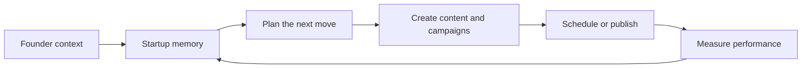
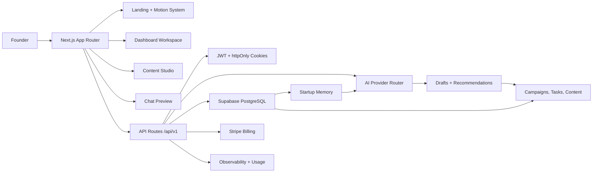
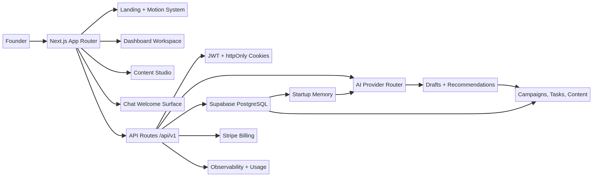
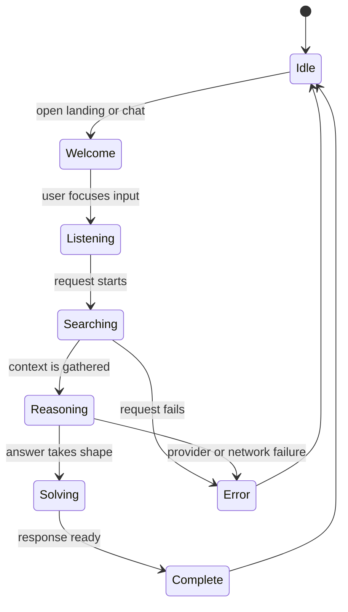
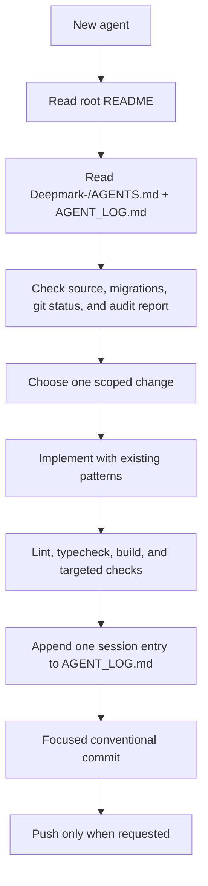
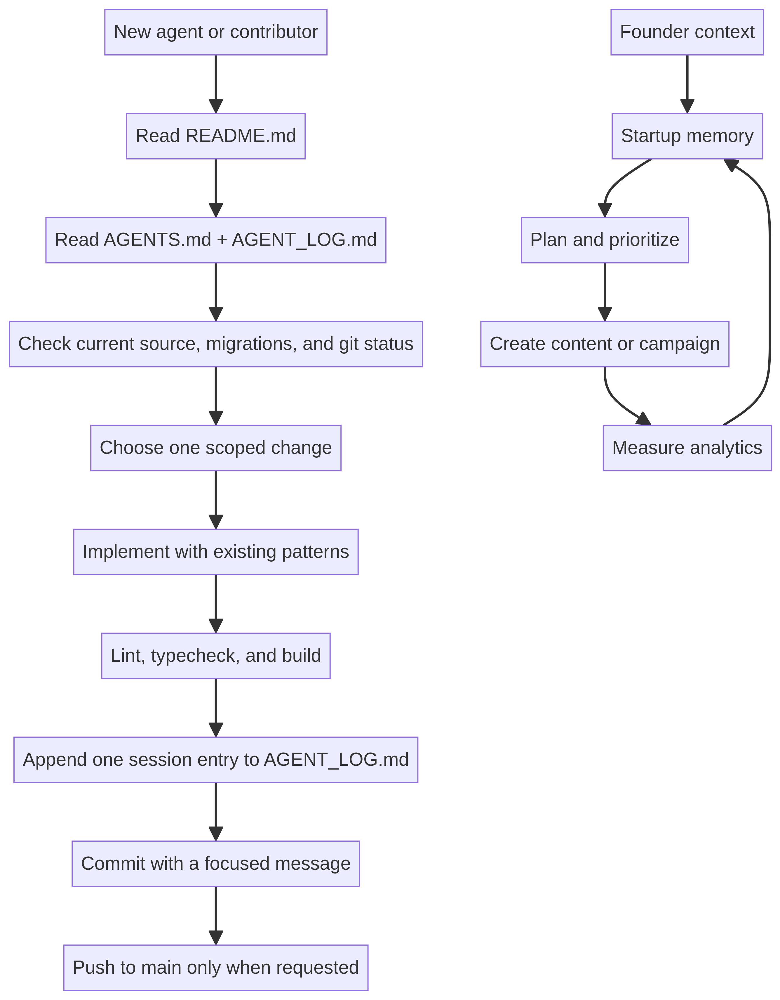

# DeepMark

> **Marketing execution intelligence for founders.**
>
> DeepMark gives a startup a working memory for its business, then turns that memory into clearer plans, differentiated content, and measurable execution.

[](https://github.com/benardprince-m/Deepmark-/actions/workflows/ci.yml)

DeepMark is an early-stage product in active development. This repository contains the Next.js application under [`Deepmark-/`](Deepmark-/), database migrations, deployment configuration, and the evidence trail used by future agents. Some flows are implemented in source, while others are intentionally marked unavailable until their data, integrations, or persistence paths are real.

This root README is the **canonical GitHub onboarding document**. Read it before changing the app. Then read [`Deepmark-/AGENTS.md`](Deepmark-/AGENTS.md) for Next.js-specific rules and [`AGENT_LOG.md`](AGENT_LOG.md) for the history of previous agent sessions.

---

## 1. What DeepMark is

Startup marketing systems often lose the connection between founder context, the content created, and the results measured. DeepMark is intended to close that loop with workspace-isolated startup memory, planning, AI-assisted content creation, and evidence-based analytics.



The product should feel less like a generic AI text box and more like a calm, memory-aware marketing partner. The current interface follows that direction: the original DeepMark mascot represents identity and presence, while a restrained orb layer represents active reasoning.

### What DeepMark is not

- A generic ChatGPT wrapper
- A dashboard full of vanity metrics
- A decorative AI interface
- A social scheduler with unverified analytics
- A competitor-copying machine
- A product that presents demo data as a user's real data

---

## 2. Current state: observed versus intended

| Area | Current state | Source of truth |
| --- | --- | --- |
| Landing | Implemented with a seven-second mascot/orb intro, skip control, reduced-motion support, and cursor-aware mascot | `Deepmark-/src/app/page.tsx`, `Deepmark-/src/components/motion/` |
| Dashboard | Authenticated workspace shell with dashboard, Studio, Chat, Planner, Plan, Analytics, and Settings routes | `Deepmark-/src/app/dashboard/` |
| Studio | Content type selection and AI generation request path are implemented | `Deepmark-/src/app/dashboard/studio/page.tsx`, `Deepmark-/src/app/api/v1/studio/` |
| Thinking states | Pong loader replaced by mascot-to-orb searching, reasoning, solving, and complete states | `Deepmark-/src/components/thinking/ThinkingAnimation.tsx` |
| Chat | Welcome/listening preview only; submission is intentionally disabled until a real chat API exists | `Deepmark-/src/app/dashboard/chat/page.tsx` |
| Planner and Plan | Honest empty/not-generated states; no fabricated upcoming posts or generic strategy goals | `Deepmark-/src/app/dashboard/planner/`, `Deepmark-/src/app/dashboard/plan/` |
| Settings | Read-only status surface until server-backed persistence is implemented | `Deepmark-/src/app/dashboard/settings/page.tsx` |
| Analytics | Reads velocity API data when available and shows a distinct error state; derived thresholds are not called independently verified | `Deepmark-/src/app/dashboard/analytics/page.tsx` |
| Authentication | JWT and cookie-based API/session flow exists; verification, recovery, and production email delivery still require runtime verification | `Deepmark-/src/app/api/v1/auth/`, `Deepmark-/src/lib/` |
| Database | Supabase migrations 001–009 are checked in; live migration state, grants, RLS, and RPC exposure must be verified in the deployed project | `Deepmark-/supabase/migrations/` |
| AI | Provider code exists but is intentionally unconfigured in this deployment; live generation is not claimed as available | `Deepmark-/src/lib/ai/` |
| Billing | Stripe handlers exist, but pricing CTAs remain disabled until workspace ownership, entitlements, callbacks, and runtime configuration are verified | `Deepmark-/src/app/api/v1/billing/`, `Deepmark-/src/app/(marketing)/pricing/` |

> A route, component, migration, or green commit is not proof that a feature works in production. Runtime evidence wins.

---

## 3. Architecture





Editable source: [`Deepmark-/docs/diagrams/architecture.mmd`](Deepmark-/docs/diagrams/architecture.mmd).

### Runtime request path

```text
Browser
  -> Next.js page or client component
  -> /api/v1 route handler
  -> auth / rate-limit / validation
  -> domain library or provider adapter
  -> Supabase, Stripe, or AI provider
  -> normalized API response
  -> UI state and motion state
```

Keep this boundary clear. Do not call Supabase service-role operations from a client component, do not expose secrets through `NEXT_PUBLIC_*`, and do not add a second auth mechanism without documenting the migration path.

---

## 4. Repository map

```text
Deepmark-/
├── AGENT_LOG.md                         # Required session history at repo root
├── Deepmark-/                            # Next.js application directory
│   ├── src/app/                          # Public pages, auth, dashboard, API routes
│   ├── src/components/                  # UI, memory, motion, AI components
│   ├── src/lib/                          # Auth, AI, Supabase, Stripe, observability
│   ├── src/types/                        # API and database types
│   ├── supabase/migrations/              # Ordered SQL migrations 001–009
│   ├── docs/diagrams/                    # Editable Mermaid + rendered PNGs
│   ├── .env.example                      # Environment variable contract
│   ├── AGENTS.md                         # Next.js agent rules
│   ├── package.json                       # Scripts and dependencies
│   └── .github/workflows/ci.yml          # CI/deploy workflow, if present in app tree
├── README.md                             # This canonical onboarding document
└── repo-audit-report.md                  # Latest static audit synthesis
```

Useful product routes:

- `/` — landing intro and mascot hero
- `/auth/login` — login surface
- `/auth/signup` — signup surface
- `/dashboard` — authenticated workspace shell
- `/dashboard/studio` — content Studio and reasoning animation
- `/dashboard/chat` — mascot welcome preview
- `/dashboard/planner` — honest planner empty state
- `/dashboard/analytics` — velocity analytics when data is available
- `/pricing` — pricing information with billing CTAs disabled until verified

---

## 5. Local development

### Prerequisites

- Node.js 20 or newer
- npm
- Supabase project for database-backed routes
- Stripe test credentials when exercising billing routes
- A configured AI provider when exercising live generation; this deployment intentionally has none configured

### Install

```bash
git clone https://github.com/benardprince-m/Deepmark-.git
cd Deepmark-/Deepmark-
npm ci
cp .env.example .env.local
```

The application requires these values for a complete environment:

```dotenv
NEXT_PUBLIC_SUPABASE_URL=https://your-project.supabase.co
NEXT_PUBLIC_SUPABASE_ANON_KEY=your-anon-key
SUPABASE_SERVICE_ROLE_KEY=your-service-role-key
JWT_SECRET=use-a-long-random-secret

STRIPE_SECRET_KEY=sk_test_...
STRIPE_WEBHOOK_SECRET=whsec_...
STRIPE_STARTER_PRICE_ID=price_...
STRIPE_PRO_PRICE_ID=price_...
STRIPE_ENTERPRISE_PRICE_ID=price_...

NEXT_PUBLIC_APP_NAME=DeepMark
NEXT_PUBLIC_APP_URL=http://localhost:3000
NODE_ENV=development
```

`JWT_SECRET` is required during server module initialization. This is the direct reason a Vercel deployment without that variable fails while collecting data for `/api/v1/ai/provider`. Add it in Vercel under the correct Production/Preview environment; never commit the value. No AI provider key is configured in the current deployment.

Run the app:

```bash
npm run dev
```

Open [http://localhost:3000](http://localhost:3000).

### Database setup

Apply migrations 001–009 in order using the Supabase CLI or dashboard. Do not create or run an ad-hoc migration route in the application. Schema changes belong in `Deepmark-/supabase/migrations/` and should be applied through a forward migration after review of tenant isolation and RLS.

---

## 6. Validation

From `Deepmark-/`:

```bash
npm ci
npx tsc --noEmit
npm run lint
npm run build
```

For a focused motion/UI change:

```bash
npx eslint src/components/motion src/components/thinking src/app/page.tsx
```

The GitHub Actions workflow runs lint, typecheck, build, and Railway deployment on `main` when its required secrets are present. If deploying to Vercel instead, configure the same application variables in the Vercel project settings, especially `JWT_SECRET`, Supabase keys, `NEXT_PUBLIC_APP_URL`, and provider/billing secrets for the routes being exercised.

---

## 7. API surface

The application API is versioned under `/api/v1`. The current route groups are:

| Group | Purpose |
| --- | --- |
| `/auth/*` | Signup, login, logout, session, refresh, verification, and password reset handlers |
| `/workspaces/*` | Workspace lifecycle and scope |
| `/startups/*` | Startup records and context |
| `/memory/*` | Workspace memory records |
| `/campaigns/*` | Campaigns and execution objects |
| `/content/*` | Content records and analytics relationships |
| `/tasks/*` | Execution tasks |
| `/trends/*` | Global and velocity trend data |
| `/analytics/*` | Startup analytics and sync operations |
| `/studio/*` | AI-assisted generation and enhancement handlers |
| `/integrations/*` | External integration records; verify methods against route files |
| `/notifications` | Notification data |
| `/subscription/*` and `/billing/*` | Usage, subscription, checkout, portal, and webhook handlers |
| `/health` | Health check |

Route names do not define auth requirements or behavior. Inspect the actual `route.ts`, its validation, ownership checks, error handling, and database queries before relying on it.

---

## 8. Motion system



The mascot is DeepMark's identity. The orb layer is a reasoning signal that emerges around it and resolves back into it. Motion honors `prefers-reduced-motion`; future heavier particle work should pause when hidden or offscreen.

---

## 9. Agent protocol





Editable source: [`Deepmark-/docs/diagrams/product-and-agent-flow.mmd`](Deepmark-/docs/diagrams/product-and-agent-flow.mmd).

Required reading order:

1. This root README.
2. [`Deepmark-/AGENTS.md`](Deepmark-/AGENTS.md).
3. [`AGENT_LOG.md`](AGENT_LOG.md).
4. [`repo-audit-report.md`](repo-audit-report.md).
5. The target route/component and any related migration.

Non-negotiables:

- Workspace isolation and tenant ownership are mandatory.
- Never reintroduce permissive RLS bypasses.
- Do not present fabricated analytics, hardcoded schedules, or simulated saves as real behavior.
- Do not expose service-role, JWT, Stripe, or provider secrets to the browser.
- Classify claims as Observed, Inferred, or Unknown.
- Preserve migration history; use forward corrective migrations.
- Log one concise entry per agent session.

---

## 10. Roadmap orientation

1. **Stabilize** — remove stale paths, unsafe behavior, misleading mock surfaces, and deployment blockers.
2. **Core reliability** — generation failures, retries, timeouts, quota enforcement, error states, and observability.
3. **Beta intelligence surfaces** — real Memory Brain and real Globe/trend data.
4. **Experience lock** — navigation, motion, accessibility, responsive behavior, and visual consistency.
5. **Connectivity and commercial** — only verified integrations, billing, entitlements, legal, and support.
6. **Beta gate** — security, reliability, UX/accessibility, and a production smoke test.

The latest static audit is available at [`repo-audit-report.md`](repo-audit-report.md). It is evidence from repository inspection, not proof of live Supabase, Stripe, email, or Vercel configuration.

---

## License

MIT
